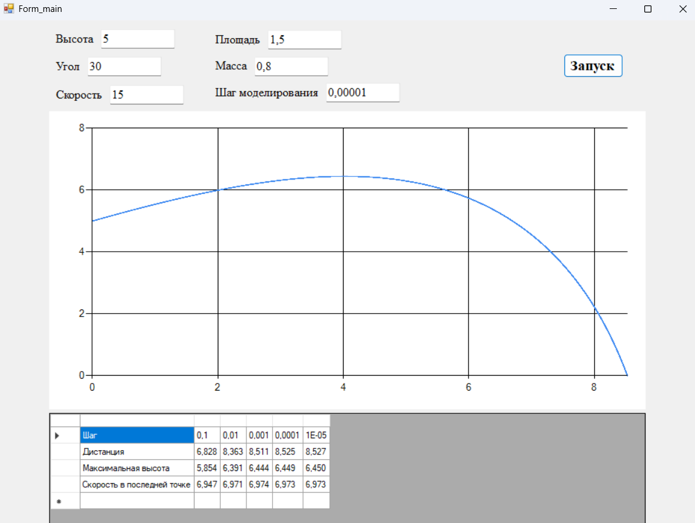

# 🛫 FlightSimulation

Projectile flight simulator with **air resistance modeling** using numerical integration.  
Симулятор полёта тела с учётом **сопротивления воздуха** методом пошагового расчёта.

---

## 📌 About / О проекте

🎓 Developed for a Simulation Modeling course.  
💡 Calculates projectile trajectory based on physics formulas with drag.  
📊 Displays results both in chart and table form.

🎓 Разработано в рамках курса по имитационному моделированию.  
💡 Моделирует траекторию движения тела с учётом сопротивления воздуха.  
📊 Выводит результаты в виде графика и таблицы.

---

## 🔧 Features / Возможности

- 📥 User input for initial parameters  
  Ввод исходных параметров (высота, скорость, угол, площадь, масса, шаг моделирования)

- 🪂 Air drag calculation (coefficient **C = 0.15**, density **ρ = 1.29**)  
  Учёт сопротивления воздуха (коэффициент **C = 0.15**, плотность **ρ = 1.29**)

- 📈 Real-time trajectory plotting  
  Построение графика траектории движения

- 📑 Automatic calculation of key results:  
  Автоматический расчёт ключевых величин:
  - Distance / Дистанция  
  - Maximum height / Максимальная высота  
  - Final speed / Скорость в последней точке  
  - Modeling step / Шаг моделирования  

- 🛡 Input validation for all parameters  
  Проверка корректности введённых данных

---

## 📁 Structure / Структура

- `Form_main.cs` — main form logic, user input validation, physics calculations, chart & table output  
  Основная форма: ввод данных, проверка, расчёт траектории, вывод графика и таблицы

---

## 🖼 Screenshots / Скриншоты

  
*Рис. 1 — Главное окно программы*
